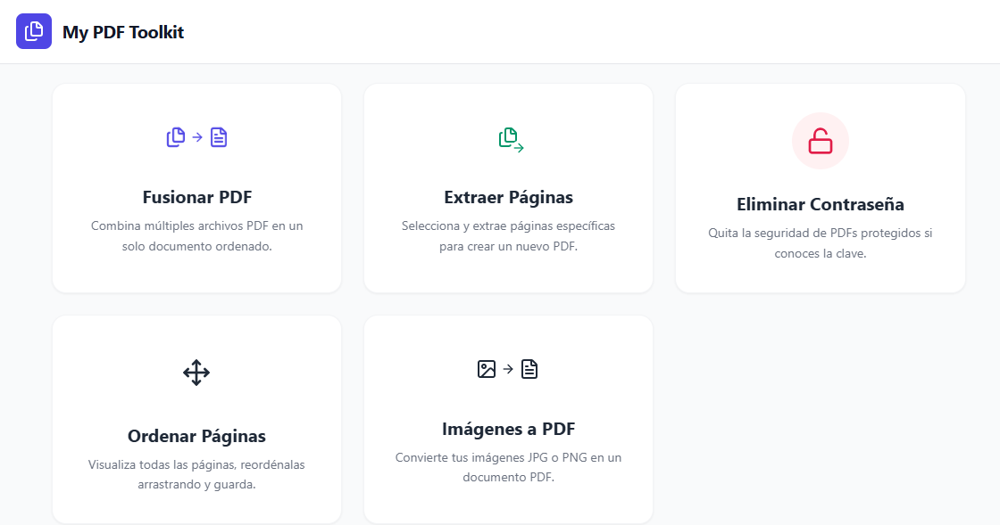
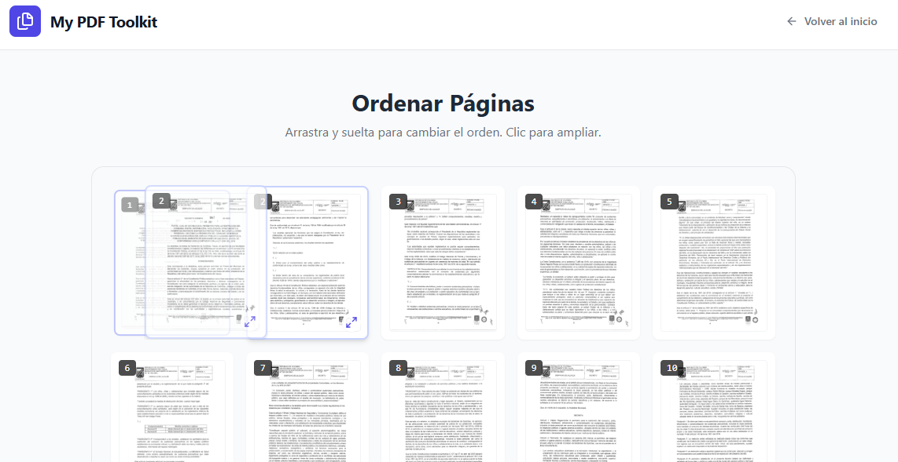

# 📄 My PDF Toolkit


**My PDF Toolkit** is a modern, fast, and secure web application for manipulating PDF files. Built with React 19 and Vite, it offers a suite of tools to manage documents directly in the browser.

> **🔒 Privacy First:** All PDF processing is performed **locally** in your browser using WebAssembly. Your files are never uploaded to a server, ensuring complete data privacy.

---

## ✨ Features

The application includes five powerful tools wrapped in a clean, user-friendly interface:

### 1. 📑 Merge PDFs (Fusionar)
Combine multiple PDF documents into a single, organized file.
- Drag and drop functionality.
- Reorder files before merging.

### 2. ✂️ Extract Pages (Extraer)
Create a new PDF containing only the specific pages you need.
- Support for individual pages (e.g., `1, 5`).
- Support for page ranges (e.g., `1-3, 8-10`).

### 3. 🔓 Unlock PDF (Desbloquear)
Remove password protection from PDF files.
- Uses standard AES 128/256-bit decryption.
- *Note: You must know the original password to remove the restriction.*

### 4. ⇄ Sort Pages (Ordenar)
Visual page organization tool.
- View thumbnails of every page in your PDF.
- Drag and drop pages to reorder them.
- Zoom/Preview specific pages before saving.

### 5. 🖼️ Images to PDF (Imágenes a PDF)
Convert your photos or scans into a professional PDF document.
- Supports JPG and PNG formats.
- Visual sorting and preview of images before conversion.

---

## 🛠️ Tech Stack

This project leverages the latest web technologies for high performance:

* **Core:** [React 19](https://react.dev/) + [TypeScript](https://www.typescriptlang.org/)
* **Build Tool:** [Vite](https://vitejs.dev/)
* **Styling:** [Tailwind CSS](https://tailwindcss.com/) + PostCSS
* **Icons:** [Lucide React](https://lucide.dev/)
* **PDF Processing:**
    * `pdf-lib` (for modification and generation)
    * `pdf.js` (for rendering previews and thumbnails)

---

## 🚀 Getting Started

Follow these steps to run the project locally on your machine.

### Prerequisites
* Node.js (v18 or higher recommended)
* npm or yarn

### Installation

1.  **Clone the repository**
    ```bash
    git clone [https://github.com/yourusername/my-pdf-toolkit.git](https://github.com/yourusername/my-pdf-toolkit.git)
    cd my-pdf-toolkit
    ```

2.  **Install dependencies**
    ```bash
    npm install
    ```

3.  **Start the development server**
    ```bash
    npm run dev
    ```

4.  Open your browser and navigate to `http://localhost:5173`

---

## 📸 Screenshots

| Dashboard | Sort Tool |
|:---:|:---:|
|  |  |

---

## 🤝 Contributing

Contributions are welcome! Please feel free to submit a Pull Request.

1.  Fork the project
2.  Create your feature branch (`git checkout -b feature/AmazingFeature`)
3.  Commit your changes (`git commit -m 'Add some AmazingFeature'`)
4.  Push to the branch (`git push origin feature/AmazingFeature`)
5.  Open a Pull Request

## 📄 License

This project is licensed under the MIT License - see the [LICENSE](LICENSE) file for details.